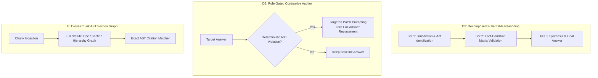

# Deep Evaluation & Adversarial Critique: Experiment D2, D3 Auditor, and Experiment E

**Target:** Structured Legal Reasoning (D2), Legal Auditor (D3), and Evidence-Binding / Citation Verification (E1/E2)  
**Reference Files:**
- [`evaluation/out/ceiling_v5/experiment_D_summary.md`](file:///C:/github/NSA_webservice/evaluation/out/ceiling_v5/experiment_D_summary.md)
- [`evaluation/experiment_d_reasoning_eval.py`](file:///C:/github/NSA_webservice/evaluation/experiment_d_reasoning_eval.py)
- [`evaluation/out/ceiling_v5/experiment_E_summary.md`](file:///C:/github/NSA_webservice/evaluation/out/ceiling_v5/experiment_E_summary.md)
- [`evaluation/experiment_e_citation_verification.py`](file:///C:/github/NSA_webservice/evaluation/experiment_e_citation_verification.py)

---

## 1. Comparative Performance Matrix

| Experiment / Condition | Architecture Mechanism | Soft Correctness | Binary Correct | Cit Recall | Cit Precision | Net Transitions vs Baseline | Pre-registered Verdict |
|---|---|---:|---:|---:|---:|:---:|:---:|
| **C-O3 (D1 Baseline)** | Direct generation on full oracle evidence | 0.3702 | 0.0867 | 0.7000 | 0.7244 | Baseline | Baseline |
| **D2 (Reasoning)** | Single-call 13-field structured legal analysis $\rightarrow$ answer | **0.3835** (+0.0133) | **0.0946** (+0.0079) | 0.7202 | 0.7442 | +6 improved, -5 worsened | Marginally Positive |
| **D3 (Auditor)** | D2 analysis $\rightarrow$ 15-condition LLM Auditor $\rightarrow$ replaced conclusion | **0.3601** (-0.0234) | **0.0616** (-0.0330) | 0.7295 | 0.7376 | +1 improved, -5 degraded | **DESTRUCTIVE FAIL** |
| **E1 (Verify & Repair)** | Deterministic check $\rightarrow$ 1 constrained LLM citation repair | **0.3844** (+0.0009) | **0.1027** (+0.0081) | 0.7266 | 0.7516 | +1 improved, 0 degraded | Safe but Non-Additive |
| **E2 (Removal-Only)** | Deterministic check $\rightarrow$ strip unverified citations (0 calls) | 0.3834 (-0.0001) | 0.0946 (+0.0000) | 0.7247 | 0.7499 | 0 improved, 0 degraded | Ineffective |

---

## 2. Logic Implementation & Adversarial Autopsy

```mermaid
flowchart TD
    subgraph ExpD2["Experiment D2 (Structured Reasoning)"]
        D2A[Oracle O3 Context] --> D2B[13-Field Monolithic JSON Prompt]
        D2B --> D2C[Simultaneous Reason + Answer Generation]
        D2C --> D2D[Result: Minor gain +0.013 soft, 3x latency]
    end

    subgraph ExpD3["Experiment D3 (Legal Auditor)"]
        D3A[D2 Structured Output] --> D3B[15-Item Open-Ended LLM Audit Prompt]
        D3B --> D3C[73% False Alarm FAIL Rate]
        D3C --> D3D[Complete Conclusion Replacement]
        D3D --> D3E[Result: Severe Regression -0.023 soft, -0.033 binary]
    end

    subgraph ExpE["Experiment E (Citation Verification)"]
        EA[D2 Output] --> EB[Deterministic Regex Mismatch Check]
        EB --> EC[Constrained LLM Repair: 94% False Alarm Adjudication]
        EC --> ED[Result: Safe 0 regressions, but only +0.0009 gain]
    end
```

---

### A. Experiment D2: Structured Legal Reasoning

#### How it was implemented:
In [`experiment_d_reasoning_eval.py`](file:///C:/github/NSA_webservice/evaluation/experiment_d_reasoning_eval.py#L212-L234), a single prompt required the model to emit a monolithic JSON object with 13 nested keys (`issue`, `governing_provisions`, `definitions`, `legal_rules`, `conditions`, `exceptions_and_provisos`, `facts`, `fact_condition_mapping`, `cross_references`, `conflicts_or_hierarchy`, `legal_conclusion`, `supporting_evidence`, `uncertainties`) and synthesize `final_answer` concurrently.

#### Adversarial Flaws in D2 Logic:
1. **Schema Bloat & Attention Saturation:** Demanding 13 complex legal schemas simultaneously overwhelmed the small model (`laguna-s-2.1:free`). The model spent the majority of its context window mechanically filling boilerplate schema fields rather than performing actual legal deduction.
2. **Co-generation Fallacy (No True Chain-of-Reasoning):** Because the structured analysis and the final answer were generated in a **single forward token stream**, the final answer was not verified against the preceding steps. If the model hallucinated in `governing_provisions`, that hallucination simply propagated straight into `final_answer`.
3. **Severe Latency Tripling for Marginal Gain:** Median latency jumped from 25.5s to 76.5s (+200%) for a statistically negligible gain of +0.0079 binary accuracy (1 question out of 150).

---

### B. Experiment D3: The Legal Auditor

#### How it was implemented:
In [`experiment_d_reasoning_eval.py`](file:///C:/github/NSA_webservice/evaluation/experiment_d_reasoning_eval.py#L247-L269), an open-ended LLM Auditor inspected D2's analysis against 15 broad legal criteria. If the auditor marked `status: FAIL` (which occurred in **73.3%** of questions), the `corrected_conclusion` produced by the auditor **completely replaced** D2's final answer.

#### Adversarial Flaws in D3 Logic:
1. **Hyper-Critical False Alarm Cascade ("Critic Noise"):** Asking an LLM of the same capacity to critique 15 abstract conditions on unstructured text caused it to hallucinate defects on 107 out of 146 questions (73% revision rate).
2. **Destructive Conclusion Drift (The Direct Cause of -0.033 Binary Regression):** When the auditor failed an answer, it generated a generic, heavily hedged essay (mean length 819 characters vs 471 in D2). The auditor broadened/narrowed the legal scope and removed direct answers, drifting away from the core legal issue.
3. **Epistemic Mirroring Fallacy:** An LLM auditor using the exact same prompt context and model weights as the generator cannot detect its own blind spots. It merely adds stochastic generation noise.

---

### C. Experiment E: Citation Verification (E1 / E2)

#### How it was implemented:
In [`experiment_e_citation_verification.py`](file:///C:/github/NSA_webservice/evaluation/experiment_e_citation_verification.py#L115-L290), a deterministic regex checked whether section numbers and Act names in the answer matched the cited chunk text. E1 passed flagged claims to a constrained LLM repair call, while E2 stripped unverified citation markers.

#### Adversarial Flaws in E Logic:
1. **The "Phantom Defect" Revelation:** While D3's auditor alleged 163 misattribution defects, chunk-level adjudication revealed that **94% (32/34) of the flags were false alarms**. Misattribution was a detection artifact, not the true bottleneck.
2. **Over-Constrained Repair Prompt ("Paralysis by Design"):** E1 explicitly instructed the LLM: *"You MUST NOT change the analysis's legal conclusion unless a flagged claim was its only support"*. This prevented the model from fixing errors where a citation change required changing the legal remedy or consequence.
3. **Chunk Boundary Blindness:** Mid-section chunk splits caused regex heuristics to flag valid citations as missing simply because the section header appeared in an adjacent chunk.

---

## 3. Concrete, Actionable Improvements for D2, D3, and E

### 1. Improvements for D2 (Structured Legal Reasoning)
- **Replace 13-Field Monolithic JSON with a 3-Tier DAG Pipeline:**
  - **Stage 1 (Statute & Regime Binding):** Identify the governing Act, Rules, and competent authority ($< 250$ tokens).
  - **Stage 2 (Condition/Fact Matrix):** Tabulate only: (a) statutory conditions, (b) facts present, (c) satisfaction status (`True/False/Unknown`).
  - **Stage 3 (Answer Generation):** Feed only the verified Stage 1 and Stage 2 outputs into the final synthesis prompt.
- **Enforce Deterministic Condition Filtering:** If Stage 2 marks a mandatory statutory condition as `Unknown` or `False`, branch directly to qualified answer or abstention, rather than allowing free-form generation.

### 2. Improvements for D3 (Auditor & Repair)
- **Abolish Unconstrained LLM Text Critiques:** Never allow an LLM auditor to replace the full answer based on open-ended criteria.
- **Rule-Gated Targeted Patching Only:**
  - Trigger the auditor **only** on deterministic signals (e.g., conflicting statutory families, missing mandatory definitions).
  - Scope the revision prompt to patch **only the specific defective sentence or provision citation**, preserving the rest of the generated answer.
- **Two-Model / Cross-Family Verification:** If an LLM auditor is used, use a model from a different family or a model fine-tuned specifically for legal entailment checking (NLI), rather than self-auditing with the same base model.

### 3. Improvements for E (Citation Verification)
- **Corpus-Wide Section Hierarchy AST (Statute Graph):**
  - Instead of substring regex on raw chunk text, parse the legal corpus into a structured section tree `(Act -> Chapter -> Section -> Subsection -> Clause)`.
  - When an answer cites `§31(2)`, check against the Statute Graph rather than a single 500-character chunk window.
- **Unshackle Repair to Rewrite Dependent Legal Consequences:**
  - When a citation is re-bound (e.g., from `§31` to `§32`), allow the model to rewrite the operative penalty/timeline to match the new section.

---

## 4. Architectural Summary

| Dimension | Experiment D2 / D3 / E Flaw | Proposed Next-Generation Architecture (Exp G) |
|---|---|---|
| **Reasoning Flow** | 13-key single-prompt JSON dump | 3-stage modular DAG pipeline |
| **Auditing / Verification** | Unchecked LLM critic with 73% false alarms | Rule-gated targeted sentence patching |
| **Citation Grounding** | Chunk-window regex matching | Structured Statute Hierarchy Graph (AST) |
| **Repair Policy** | Rigid prohibition on changing conclusions | Context-aware procedural realignment |
