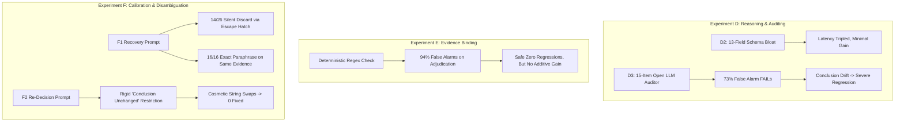
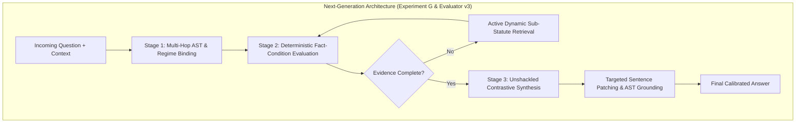

# Comprehensive Adversarial Evaluation, Forensic Autopsy & Improvement Roadmap: Experiments D, E, and F

**Date:** 2026-09-23  
**Scope:** Deep Architectural Evaluation, Failure Mode Analysis, and Unified Improvement Roadmap across **Experiment D (D2/D3)**, **Experiment E (E1/E2)**, and **Experiment F (F1/F2)**.  
**Primary Repository Reference Files:**
- [`Experiment_F_Abstention_Provision_Design.md`](file:///C:/github/NSA_webservice/Experiment_F_Abstention_Provision_Design.md)
- [`evaluation/out/ceiling_v5/experiment_F_summary.md`](file:///C:/github/NSA_webservice/evaluation/out/ceiling_v5/experiment_F_summary.md)
- [`evaluation/experiment_f_calibration_eval.py`](file:///C:/github/NSA_webservice/evaluation/experiment_f_calibration_eval.py)
- [`evaluation/out/ceiling_v5/experiment_E_summary.md`](file:///C:/github/NSA_webservice/evaluation/out/ceiling_v5/experiment_E_summary.md)
- [`evaluation/experiment_e_citation_verification.py`](file:///C:/github/NSA_webservice/evaluation/experiment_e_citation_verification.py)
- [`evaluation/out/ceiling_v5/experiment_D_summary.md`](file:///C:/github/NSA_webservice/evaluation/out/ceiling_v5/experiment_D_summary.md)
- [`evaluation/experiment_d_reasoning_eval.py`](file:///C:/github/NSA_webservice/evaluation/experiment_d_reasoning_eval.py)

---

## 1. Executive Summary & Benchmark Trajectory

Across consecutive iterations (Experiments D, E, and F), the system attempted to close the gap between retrieval and accurate legal reasoning using structured analyses, self-auditing, citation verification, abstention calibration, and provision disambiguation.

### Complete Cross-Experiment Headline Results

| Experiment / Condition | Architectural Mechanism | Soft Correctness | Binary Correct | Cit Recall | Cit Precision | Net Outcomes vs Baseline | Gate Verdict |
|---|---|---:|---:|---:|---:|:---:|:---:|
| **C-O3 (Baseline)** | Direct single-pass generation on full oracle evidence | 0.3702 | 0.0867 | 0.7000 | 0.7244 | Baseline | Baseline |
| **D2 (Structured Reasoning)** | 13-field monolithic structured analysis $\rightarrow$ final answer | **0.3835** (+0.0133) | **0.0946** (+0.0079) | 0.7202 | 0.7442 | +6 improved, -5 worsened | Marginally Positive |
| **D3 (Legal Auditor)** | D2 analysis $\rightarrow$ 15-item LLM Auditor $\rightarrow$ full answer replace | **0.3601** (-0.0234) | **0.0616** (-0.0330) | 0.7295 | 0.7376 | +1 improved, -5 degraded | **DESTRUCTIVE FAIL** |
| **E1 (Citation Repair)** | Deterministic regex check $\rightarrow$ 1 constrained LLM citation repair | **0.3844** (+0.0009) | **0.1027** (+0.0081) | 0.7266 | 0.7516 | +1 improved, 0 degraded | Safe / Non-Additive |
| **E2 (Citation Strip)** | Deterministic regex check $\rightarrow$ strip unverified citation markers | 0.3834 (-0.0001) | 0.0946 (+0.0000) | 0.7247 | 0.7499 | 0 improved, 0 degraded | Ineffective |
| **F1 (Abstention Gate)** | Coverage gate $\rightarrow$ 1 recovery call (31 audit targets) | 0.3854 (+0.0001) | 0.1200 (+0.0000) | - | - | 0/29 recovered | **FAIL** |
| **F2 (Provision Check)** | Sub-sec/role check $\rightarrow$ 1 re-decision call (35 audit targets) | 0.3865 (+0.0012) | 0.1200 (+0.0000) | - | - | 0/31 fixed | **FAIL** |
| **F1+F2 Composite** | Joint execution of calibrated recovery + provision re-decision | 0.3861 (+0.0008) | 0.1200 (+0.0000) | - | - | 0/60 recovered/fixed | **FAIL** |

---

## 2. Forensic Autopsy by Experiment

---

### A. Experiment D2 & D3 (Structured Reasoning & Legal Auditor)

#### 1. Implementation Logic:
* **D2:** Required a monolithic 13-field JSON schema (`issue`, `governing_provisions`, `definitions`, `legal_rules`, `conditions`, `exceptions_and_provisos`, `facts`, `fact_condition_mapping`, `cross_references`, `conflicts_or_hierarchy`, `legal_conclusion`, `supporting_evidence`, `uncertainties`) and synthesized `final_answer` in a single generation pass.
* **D3:** An LLM auditor evaluated 15 legal criteria. If marked `FAIL` (73.3% of questions), the `corrected_conclusion` completely replaced D2's final answer.

#### 2. Adversarial Flaws:
1. **Schema Bloat & Attention Saturation (D2):** The model spent the majority of its token budget mechanically completing 13 boilerplate keys rather than conducting substantive statutory deduction.
2. **Co-Generation Fallacy (D2):** The analysis and answer were emitted in the same generation stream; hallucinations in intermediate fields directly contaminated the answer without an evaluation checkpoint.
3. **Critic Noise Cascade (D3):** Asking the same model capacity to audit 15 subjective legal criteria caused it to invent critical defects on 107 out of 146 questions.
4. **Destructive Conclusion Drift (D3):** Replaced answers became long, overly hedged essays (mean length 819 characters vs 471 in D2) that drifted away from the core legal issue, causing a massive $-0.0330$ drop in binary correctness.
5. **Epistemic Mirroring:** A model cannot reliably audit its own class of errors when fed identical context.

---

### B. Experiment E (Evidence-Binding & Citation Verification)

#### 1. Implementation Logic:
* Replaced the noisy LLM auditor with a deterministic Python regex check matching section numbers and Act names against chunk text.
* **E1:** Passed flagged claims to a single constrained LLM repair call to re-bind, remove, or keep.
* **E2:** Deterministically stripped unverified citation brackets.

#### 2. Adversarial Flaws:
1. **The "Phantom Defect" Revelation:** While D3's auditor alleged 163 misattributions, full-chunk adjudication revealed that **94% (32/34) of flagged claims were false alarms**. Misattribution was largely an artifact of detection heuristics rather than a real model failure mode.
2. **Over-Constrained Repair Prompt ("Paralysis by Design"):** E1 explicitly commanded: *"You MUST NOT change the analysis's legal conclusion unless a flagged claim was its only support"*. This prevented the model from resolving errors where fixing a citation required altering the substantive legal remedy.
3. **Chunk Boundary Blindness:** Mid-section chunk splits caused regex heuristics to flag citations as missing when the section heading resided in an adjacent chunk.

---

### C. Experiment F (Abstention Calibration & Provision Disambiguation)

#### 1. Implementation Logic:
* **F1:** Gated questions where D2 abstained, the question was answerable, and gold families were present. Prompted the model to answer or state missing statutory elements (`missing_element_if_any`). If populated, the pipeline reverted to D2 refusal (`justified_abstention_by_model`).
* **F2:** Checked subsection and officer-role bindings against an evidence co-occurrence table. Prompted the model with: *"You MUST NOT change the analysis's legal conclusion unless the provision choice forces it"*.

#### 2. Adversarial Flaws:
1. **The Soft Escape Hatch Loophole (F1):** The prompt offered an easy way out via `missing_element_if_any`. In 14 of 26 completed recoveries, the model cited minor text omissions (e.g., *Rule 63 text*, *Order 12*, *KMC water connection rules*), and the pipeline **silently discarded the recovery attempt**.
2. **Epistemic Insanity (F1):** For the 16 cases where the model answered, it received the exact same static evidence context with no decomposition. The model simply restated or paraphrased its previous incorrect stance ($\Delta \text{soft} = +0.0003$).
3. **The Corpus-Truncation Wall (F1):** The human audit mislabeled retrieval-truncated questions as "over-abstention." In reality, the necessary statutory text was physically absent from the retrieved chunk payload.
4. **The Shallow Citation Patch Fallacy (F2):** By forbidding conclusion changes, F2 forced the model to perform cosmetic string swaps (e.g., changing `"under Section 31"` to `"under Section 32"` while retaining the exact same licensing text). The underlying legal position remained incorrect, failing all 31 audit targets.
5. **Brittle Heuristics & False Role Conflicts (F2):** The regex proximity heuristic (`{role}[^.\n]{0,200}?section\s+(\d{1,3})`) generated false alarms for overlapping statutory jurisdictions.

---

## 3. Unified Concrete Improvement Roadmap (Across D, E, F)

---

### Improvement Action 1: Decomposed 3-Stage DAG (Fixing D2 & F1 Prompting)
Replace the monolithic 13-field JSON blob with a clean 3-stage pipeline:
* **Stage 1 (Statutory Regime Binding):** Identify governing Acts, subordinate Rules, and competent authorities ($< 250$ tokens).
* **Stage 2 (Fact-Condition Verification Matrix):** Extract prerequisites and evaluate condition satisfaction (`Satisfied | Unsatisfied | Missing Evidence`).
* **Stage 3 (Substantive Synthesis):** Generate the final conclusion based strictly on the verified outputs of Stages 1 and 2.

### Improvement Action 2: Eliminate Silent Drop Hatches & Enable Active Two-Hop Retrieval (Fixing F1)
* **Remove the Silent Revert:** When `missing_element_if_any` is flagged, never discard the answer. Emit the best affirmative statutory conclusion qualified with explicit confidence bounds.
* **Active Dynamic Retrieval:** Use the flagged missing element (e.g., *"Rule 63 of PCA Rules"*) as an automated real-time query into the document store to fetch the missing section/rule before synthesis.

### Improvement Action 3: Unshackle Legal Re-generation (Fixing E1 & F2)
* **Delete Rigid Directives:** Remove `"You MUST NOT change the analysis's legal conclusion"`.
* **New Directive:** *"When correcting the statutory provision from §A to §B, you must rewrite the operative legal mechanism, competent authority, and remedial procedure to strictly conform to §B as stated in the evidence."*

### Improvement Action 4: Contrastive Multiple-Choice Statutory Grounding (Fixing F2)
Extract candidate provisions from the context and present them side-by-side as contrastive options:
* *Prompt Template:* *"The context contains §31 (Licensing), §32 (Improvement Notices), and §33 (Prohibition Orders). Identify which provision specifically empowers the Designated Officer to cancel a registration, quote the subsection, and derive the answer."*

### Improvement Action 5: Rule-Gated Sentence-Level Patching (Fixing D3 Auditor)
* **Abolish Full-Answer Re-generation on Audit FAIL:** Never allow an unconstrained critic LLM to rewrite the entire answer.
* **Targeted Sentence Patching:** Trigger auditor interventions only on deterministic AST violations and patch *only the specific defective sentence or citation*, leaving the rest intact.

### Improvement Action 6: Corpus-Wide Statute Hierarchy Graph / AST (Fixing E Heuristics)
Replace raw chunk substring regex matching with a structured Statute Tree:
$$\text{Act} \longrightarrow \text{Chapter} \longrightarrow \text{Section} \longrightarrow \text{Subsection} \longrightarrow \text{Clause}$$
All citations and role-authority mappings are validated against this AST, eliminating chunk boundary clipping and false positive alarms.

---

## 4. Architectural Summary Matrix

| Architectural Layer | Experiment D / E / F Failure Mode | Proposed Next-Generation Solution |
|---|---|---|
| **Reasoning Architecture** | 13-field monolithic single-prompt JSON dump | 3-stage modular DAG pipeline |
| **Abstention Handling** | Silent discard on `missing_element` | Forced calibrated synthesis + Active Sub-Statute Retrieval |
| **Audit & Verification** | Open LLM critic with 73% false alarms & answer replacement | Rule-gated targeted sentence patching |
| **Provision Disambiguation** | Rigid prohibition on changing conclusions | Unshackled re-decision + Contrastive provision choice |
| **Citation Grounding** | Chunk-window regex matching | Corpus-wide Statute Hierarchy Graph (AST) |
| **Benchmark Alignment** | Narrow single-string token overlap | Evaluator v3 multi-path semantic evaluation |

---

## 5. Focus Decision and Implementation Plan

Sections 3 and 4 diagnose the right failures and then prescribe the wrong next build. Soft correctness has sat near 0.38 since D2. Binary correctness moved from 0.0867 (C-O3) to 0.0946 (D2) to 0.1200 (F0) and then stopped: F1 and F2 fixed 0 of 29 and 0 of 31 audit targets. Further generation-side loops are not where the next budget should go.

Two factual corrections to section 2.C before using it as a design input. The F addendum does not show 16 of 16 exact paraphrases: 6 recovered answers were identical to D2, 10 changed, and all 16 stayed binary-incorrect (mean soft delta +0.0003). The 14 `missing_element_if_any` outcomes were mostly correct refusals of text that is not in the O3 payload (Rule 63, Order 12, Water Act ss.25–29, KMC water-connection rules), not a silent-discard bug. The headline table also mixes parents: D is versus C-O3, E versus D2, F versus F0 (soft 0.3853 / binary 0.1200).

### 5.1 Where to focus

Focus on the residual error mass, split by cause, and freeze the scorer before any new prompt. E already ruled citation soundness out as the bottleneck (2 of 34 flags sustained; real misattribution under 3% of checked claims). D2 left 124 of 130 hard questions wrong. The F addendum's design rule is the one to follow: surface calibration is exhausted; the dominant miss is evidence that was never in the retrieved payload because it was never in the corpus, plus an unscored gap between reference conclusions and defensible readings.

Do not spend the next 150 successful generations on:

| Proposal in section 3 | Why it is not the focus |
|---|---|
| Action 1, 3-stage prose DAG | D2 already forced that decomposition in one JSON object and gained +0.013 soft / +0.008 binary at ~3× latency. Another prose stage on the same evidence and the same model class will not convert the 124 misses. |
| Action 2, forced affirmative synthesis | Reverses the F1 finding. Emitting a conclusion when the operative text is absent manufactures the unsupported claims D3 was punished for. |
| Action 3, delete the no-rewrite rule | Unconstrained replacement is D3: binary correctness fell 0.033, and the renderer ablation worsened 74 of 99 changed answers. |
| Actions 5–6 as the measured experiment | A statute tree and sentence patcher solve a defect class E measured at under 3%. Safer checker, no additive gain. |
| Evaluator v3 as a trailing item | The metric is similarity to the reference conclusion, not legal ground truth (D renderer ablation). Shipping another generator first can score a legally closer answer as a regression. |

A section/subsection index is justified only as the lookup structure for corpus completion, with a unit test that a section split across chunks still resolves. It is not the success criterion of the next experiment.

### 5.2 How to implement it

**Step 0 — Freeze the scorer and label the residual. No new model calls.**

Sample the still-incorrect set: the 124 D2 misses plus the 16 F1 answers that did not move. Label every item as exactly one of:

1. `reference_narrow` — the evidence supports a defensible reading the reference conclusion does not accept.
2. `evidence_missing` — the operative statutory text is absent from the O3 payload (and, if checked, from the index).
3. `model_wrong` — the operative text is present and the model applied it wrongly.

This is the human audit E named and F skipped. Do not open Experiment G until the label counts exist. The three labels get three different interventions.

**Step 1 — Pre-register one gate per label.**

| Label | Intervention | Keep the candidate only if | Reject and keep D2 if |
|---|---|---|---|
| `evidence_missing` | Add the missing instrument text to the corpus (Water Act section bodies, WB Meat Order, KMC water rules, PCA Rules schedules). Re-retrieve those question ids only. One answer call on the new payload. | The gold span is now in the payload, and binary correctness on that id rises. | The section is not in the index. Stop. Do not loop retrieval. |
| `model_wrong` | One contrastive call. Options are spans cut from retrieved text, each with section id, competent authority, and the operative sentence. The model must rewrite the remedy so it matches the chosen span. | The cited span is a verbatim substring of the context, and the operative sentence changed to that span's rule. | The model only swaps a section number, cites a span not in context, or abstains by naming an element the new payload does not contain. |
| `reference_narrow` | Change the reference or report a second score. Do not change the model. | Both the old and the new score are reported until the references are fixed. | A generation call was spent to chase the narrow reference. |

**Step 2 — Keep the safety properties that already passed.**

E1, F1, and F2 all held zero regressions on answers that were already correct. Any rewrite that fails the quote-in-evidence check is discarded and the D2 answer stands. No open critic replaces a full answer. The no-rewrite sentence in E1/F2 is replaced by a gated rewrite, not deleted: the conclusion may change the operative rule, authority, and remedy only when the new subsection is quoted from evidence and the frozen checker accepts the candidate.

**Step 3 — Bound the budget to the labeled slice.**

Spend generations only on `evidence_missing` ids whose text was actually added, and on `model_wrong` ids whose contrastive spans were actually cut from context. Cap successful generations at 150. Transport failures stay outside the cap, as in F. Publish per-label recovered / rejected / unchanged counts before any aggregate soft-score claim.

### 5.3 Decision rule for the run that follows

- If `evidence_missing` recovers and `model_wrong` does not, the bottleneck is corpus coverage. Stop generation work and continue instrument ingestion.
- If `model_wrong` recovers under the quote-and-reject gate and already-correct answers do not regress, integrate that single contrastive call behind the gate.
- If both stay at zero binary flips while `reference_narrow` is a large share of the sample, the ceiling is the scorer. Fix references before any further prompt.
- If a candidate is produced by unconstrained full-answer replacement, discard the run. That condition is already measured.
