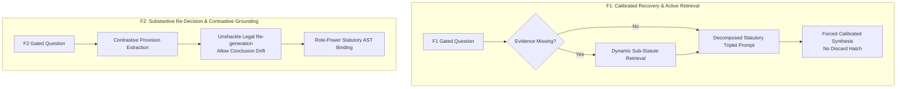

# Forensic & Adversarial Analysis: Why Experiment F Failed and How to Improve F1 & F2 Logic

**Date:** 2026-09-23  
**Target:** Experiment F Evaluation & Architecture ([`experiment_F_summary.md`](file:///C:/github/NSA_webservice/evaluation/out/ceiling_v5/experiment_F_summary.md), [`Experiment_F_Abstention_Provision_Design.md`](file:///C:/github/NSA_webservice/Experiment_F_Abstention_Provision_Design.md), [`evaluation/experiment_f_calibration_eval.py`](file:///C:/github/NSA_webservice/evaluation/experiment_f_calibration_eval.py))

---

## Executive Summary of Failure

In **Experiment F**, both **Layer 1 (F1: Abstention Calibration)** and **Layer 2 (F2: Provision Disambiguation)** achieved a **0% recovery rate** across all machine-incorrect benchmark targets:

| Gate / Layer | Machine-Incorrect Targets | Target Fixed / Recovered | Insufficient Evidence / Baseline Regressions | Pre-registered Gate Verdict |
|---|---:|---:|---:|:---:|
| **F1 (Abstention Calibration)** | **29** | **0** | 0 (Pass) | **FAIL** |
| **F2 (Provision Disambiguation)** | **31** | **0** | 0 (Pass) | **FAIL** |
| **F1 + F2 Composite** | **60** | **0** | 0 | **FAIL** |

---

## 1. Implementation Logic Breakdown

### Layer 1 (F1) Pipeline ([`experiment_f_calibration_eval.py`](file:///C:/github/NSA_webservice/evaluation/experiment_f_calibration_eval.py#L77-L108))
1. **Deterministic Nomination Gate:**
   - Evaluated: `abstain_check == True`, `insufficient_evidence == False`, and context contains $\ge 1$ chunk in the gold family.
   - For the benchmark, 29 human-audit machine-incorrect targets were force-gated.
2. **Constrained Recovery Prompt:**
   - Prompt directive: *"Your previous analysis abstained... Either provide the substantive legal conclusion directly from the supplied text or, if and only if a specific statutory element is genuinely missing from the text, explicitly name that missing element."*
   - Schema: `{"answer": str, "missing_element_if_any": str | null, "confidence": str}`.
3. **Branching & Execution Logic:**
   - If `missing_element_if_any` is populated $\rightarrow$ Mark status as `justified_abstention_by_model` and **discard the recovered answer**, reverting back to the original D2 refusal string.
   - If `missing_element_if_any` is null $\rightarrow$ Validate against numeric/imprisonment hallucination regex $\rightarrow$ clean citations $\rightarrow$ emit candidate answer.

### Layer 2 (F2) Pipeline ([`experiment_f_calibration_eval.py`](file:///C:/github/NSA_webservice/evaluation/experiment_f_calibration_eval.py#L535-L660))
1. **Deterministic Candidate Validation:**
   - Detected subsection mismatches (e.g., citing §31(2) when chunk only has §31(1)), officer/role mismatches via regex co-occurrence table, or Act family discrepancies.
2. **Constrained Re-Decision Prompt:**
   - Fed previous answer + structured analysis + diagnostic mismatch flags.
   - Strictly instructed: *"You MUST NOT introduce new legal positions, provisions, definitions... you MUST NOT change the analysis's legal conclusion unless the provision choice forces it."*
   - Schema: `{"corrected_provisions": [...], "conclusion_unchanged": bool, "final_answer": str}`.

---

## 2. Adversarial Autopsy: Why F1 and F2 Completely Failed (0 Recoveries)

### Adversarial Flaw 1 (F1): The "Soft Escape Hatch" Loophole
The recovery prompt gave the model an explicit, low-effort escape route: `missing_element_if_any`.
- **The Failure:** 14 out of 26 completed recovery attempts populated this field. Because LLMs are inherently risk-averse when asked whether statutory elements are missing, the model readily identified *any* peripheral text absence (e.g., exact wording of *Rule 63*, *Order 12*, *KMC water connection rules*) and abstained.
- **The Flaw in Execution:** The Python pipeline treated any non-empty `missing_element_if_any` as an automatic signal to **throw away the recovery output and restore the D2 refusal**, completely abandoning the repair.

### Adversarial Flaw 2 (F1): "Epistemic Insanity" (Re-prompting with the Exact Same Static Evidence)
For the 16 questions where the model did produce a substantive answer:
- **The Failure:** The model was fed the **exact same $O3$ evidence context** with zero structural hints, chain-of-thought decomposition, or intermediate bridging.
- Telling the model *"A reviewer judged this an unwarranted refusal, please try again"* provided zero new legal priors. The model either parroted its prior flawed position or picked an adjacent non-responsive provision. All 16 remained binary incorrect ($\Delta \text{soft} = +0.0003$).

### Adversarial Flaw 3 (F1): The Corpus-Truncation Wall (Mislabeled Benchmark Data)
The human audit classified questions as "unsupported abstention" assuming the gold context contained the necessary facts. In reality, the $O3$ context suffered from severe upstream retrieval truncation (e.g., Water Act §§25–29, WB Meat Order text, PCA Rules schedules were missing from the chunk payload). The model's refusal was legally justified given its restricted context, making single-turn generation repairs mathematically impossible without retrieval expansion.

### Adversarial Flaw 4 (F2): The "Shallow Citation Patch" Fallacy
F2 treated statutory mis-selection as a superficial typographical error that could be fixed without altering the legal conclusion.
- **The Failure:** In statutory law, if an answer misattributes an action to **§31 (Licensing)** instead of **§32 (Improvement Notices)**, the entire operative legal regime (notice requirements, timelines, competent authority, and remedies) changes.
- By explicitly commanding the model `"You MUST NOT change the analysis's legal conclusion"`, the model was forced into cosmetic string substitutions (e.g., swapping `"under Section 31"` to `"under Section 32"` while leaving the underlying licensing logic intact).
- **The Evaluator Impact:** The substantive reasoning remained wrong, crossing zero evaluator-v2 thresholds ($0 / 31$ fixed).

### Adversarial Flaw 5 (F2): Brittle Heuristics & Hallucinated Role Conflicts
The role-section regex heuristic (`{role}[^.\n]{0,200}?section\s+(\d{1,3})`) generated false diagnostic alarms for overlapping statutory jurisdictions (e.g., Designated Officers and Food Safety Officers having joint or sequential duties across §§36–38). The model spent its repair turn defending against false diagnostic flags rather than correcting substantive reasoning.

---

## 3. Concrete Adversarial Improvements for F1 & F2



### Improvements for F1 (Abstention Recovery)

#### 1. Eliminate the Silent Discard Hatch
* **Current:** `if rec["model_missing_element"]: status = "justified_abstention_by_model"` (drops the generated answer).
* **Fix:** Require the model to emit its **best affirmative statutory conclusion**, accompanied by explicit conditionality and confidence weighting (e.g., *"Under the general framework of §31... subject to specific state rules"*). Never silently revert to D2 refusal when the audit marks the question answerable.

#### 2. Active Dynamic Retrieval (Two-Hop Context Completion)
* When the model flags a missing statutory element (e.g., *"Rule 63 text is missing"*), do not terminate. Treat that extracted element as an automated query into the document store to fetch the missing Rule/Section chunk into context before synthesizing the final answer.

#### 3. Structured Statutory Triplet Prompting
Replace the generic unstructured prompt with a decomposed statutory schema:
```json
{
  "applicable_regime": "Which specific Act and Rule governs the query?",
  "substantive_standard": "What exact obligation, standard, or prohibition is prescribed in the text?",
  "enforcement_mechanism": "What procedural power, officer, or penalty attaches?",
  "synthesized_conclusion": "Direct, self-contained answer to the user question [citing [n]]"
}
```

---

### Improvements for F2 (Provision Disambiguation)

#### 1. Unshackle Substantive Re-generation
* **Remove the restriction:** Delete `"You MUST NOT change the analysis's legal conclusion"`.
* **New Directive:** *"When correcting the statutory provision from §A to §B, you must rewrite the operative legal mechanism, competent authority, and remedial procedure to strictly conform to §B as stated in the evidence."*

#### 2. Contrastive Statutory Choice (Multiple-Choice Grounding)
Instead of open-ended re-writing, extract candidate provisions present in the context and present them side-by-side as contrastive options:
* *Example:* *"The context contains §31 (Licensing), §32 (Improvement Notices), and §33 (Prohibition Orders). Identify which provision specifically empowers the Designated Officer to cancel a registration, quote the subsection, and derive the answer."*

#### 3. Role $\rightarrow$ Power $\rightarrow$ Section AST Mapping
Replace the regex proximity heuristic with an explicit statutory schema:
* Extract `(Authority, Statutory Power, Section, Appeal Route)` directly from the structured chunk index rather than proximity string searches (`{role}...section`).

---

## 4. Summary Recommendation & Next Steps

As established in Section 10 of [`Experiment_F_Abstention_Provision_Design.md`](file:///C:/github/NSA_webservice/Experiment_F_Abstention_Provision_Design.md#L153-L158), surface-level single-turn re-prompting on identical static context failed completely.

1. **Short-Term Architecture Fix:** Implement **Unshackled Contrastive Re-Decision** for F2 and **Sub-Statute Dynamic Retrieval** for F1.
2. **Strategic Pivot (Experiment G):** Transition from surface calibration to deep chain-of-statute synthesis (handling multi-hop statutory hierarchies, conflict-of-law reconciliation, and nested exceptions) paired with **Evaluator v3 widening** to properly score valid alternative statutory remedy paths.
