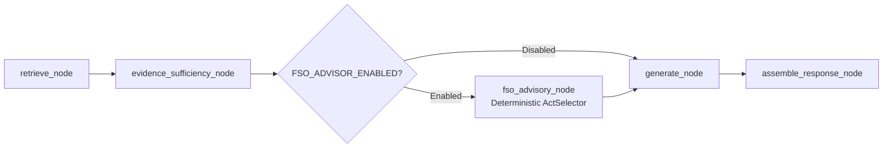

# FSO Strategic Advisory (Game Theory + Talebian) Implementation Blueprint

- **Status:** Proposed / Ready for Implementation
- **Target Seam:** `app/rag/advisor/`
- **Graph Integration:** `app/rag/agent/graph.py` (Node: `fso_advisory_node`)
- **Related ADR:** [ADR-0003: FSO strategic advisory agent](file:///C:/github/NSA_webservice/docs/adr/0003-fso-strategic-advisory-agent.md)
- **Domain Context:** [CONTEXT.md](file:///C:/github/NSA_webservice/CONTEXT.md)

---

## 1. Executive Summary

This document specifies the architecture and mathematical formulation for replacing soft/non-deterministic LLM advisory prompts with a pure, deterministic **Game-Theoretic and Talebian Strategy Engine** for the Food Safety Officer (FSO) Strategic Advisory module.

### Core Objectives
1. **100% Deterministic & Auditable:** Pure Python functions over grounded statutory evidence; guarantees zero hallucination and mathematical repeatability.
2. **Fail-Closed Safety:** If retrieved chunks lack actionable statutory anchors (§ provisions), the module safely abstains with `abstain_reason = "insufficient_statutory_grounding"`.
3. **Sub-millisecond Execution:** Zero LLM latency and zero token cost for act selection.
4. **Offline Testability:** Complete unit test suite coverage using standard `pytest` fixtures.

---

## 2. Mathematical & Strategic Formulation

```
                     ┌─────────────────────────────────────────────────────────┐
                     │              Grounded Legal Evidence                    │
                     │   (Extracted Sections: §32, §51, §55, §63, §64, etc.)   │
                     └────────────────────────────┬────────────────────────────┘
                                                  │
                                                  ▼
                     ┌─────────────────────────────────────────────────────────┐
                     │          2-Player Strategic Game Matrix                 │
                     │      FSO Action Space  vs  FBO Strategy Space           │
                     └────────────────────────────┬────────────────────────────┘
                                                  │
                                                  ▼
                     ┌─────────────────────────────────────────────────────────┐
                     │      Game-Theoretic Filter (Minimax / Dominance)        │
                     │  Eliminate under-deterrent moves given FBO defection    │
                     └────────────────────────────┬────────────────────────────┘
                                                  │ Admissible Subset
                                                  ▼
                     ┌─────────────────────────────────────────────────────────┐
                     │         Talebian Convexity & Optionality Filter         │
                     │    Score: Reversibility × InfoGain - Irreversibility    │
                     └────────────────────────────┬────────────────────────────┘
                                                  │
                                                  ▼
                     ┌─────────────────────────────────────────────────────────┐
                     │     Deterministic Decision (Act + Proof Matrix)         │
                     │            fso_act: Action, StatutoryAnchor             │
                     └─────────────────────────────────────────────────────────┘
```

### A. Players & Action Spaces
1. **Player 1 (FSO - Enforcement Authority)**:
   Pure action space based on the statutory **FSO Escalation Ladder**:
   $$A_{FSO} = \{a_1, a_2, a_3, a_4, a_5\}$$
   - $a_1$: **Inspect & Warn** (Informal advisory, low friction, zero legal burden)
   - $a_2$: **Sample & Lab-Test** (Statutory evidence generation, high optionality)
   - $a_3$: **Improvement Notice u/s 32** (Binding statutory timeline for rectification)
   - $a_4$: **Show-Cause / Penalty Direction u/s 55** (Administrative penalty track)
   - $a_5$: **Prosecution / Licence Cancellation u/s 63, 64** (Court trial, high irreversibility)

2. **Player 2 (FBO - Food Business Operator)**:
   Strategy space $S_{FBO} = \{\text{Comply}, \text{Delay / Contest}, \text{Willful Defection}\}$

### B. Utility & Payoff Functions
For an action $a \in A_{FSO}$ and grounded statutory section $\S \in \text{RetrievedSections}$:
- **Statutory Penalty Anchor** $P(\S)$: Maximum statutory schedule under FSS Act (e.g., §51 = ₹5L; §52 = ₹3L; §55 = ₹2L; §56 = ₹1L; §58 = ₹2L; §63 = ₹5L + 6 mo; §64 = 2× penalty + cancellation).
- **FSO Enforcement Cost** $C_{FSO}(a)$: Administrative burden, court appearance overhead, legal reversal risk:
  $$C_{FSO}(a_1) = 1, \quad C_{FSO}(a_2) = 3, \quad C_{FSO}(a_3) = 2, \quad C_{FSO}(a_4) = 4, \quad C_{FSO}(a_5) = 10$$
- **FSO Utility**:
  $$U_{FSO}(a, s, \S) = \text{Deterrence}(a, \S) - C_{FSO}(a) - \text{StatutoryGapPenalty}(a, \S)$$

### C. Talebian Optionality & Convexity Scoring
To prevent premature escalation into fragile/irreversible commitments (e.g., jumping straight to court prosecution without a lab report), each action is scored for **convexity**:
$$\text{Opt}(a) = \text{Reversibility}(a) \times \text{InformationYield}(a) - \lambda \cdot (1.0 - \text{Reversibility}(a))$$

| Escalation Level | Action | Reversibility ($R$) | Info Yield ($I$) | Downside Risk ($1-R$) | Optionality Index |
| :--- | :--- | :---: | :---: | :---: | :---: |
| Level 1 | $a_1$: Inspect & Warn | 1.0 | 0.2 | 0.0 | **+0.20** |
| Level 2 | $a_2$: Sample & Lab-Test | 0.9 | 1.0 | 0.1 | **+0.85 (Max Convexity)** |
| Level 3 | $a_3$: Improvement Notice §32 | 0.8 | 0.7 | 0.2 | **+0.46** |
| Level 4 | $a_4$: Penalty Direction §55 | 0.5 | 0.4 | 0.5 | **-0.05** |
| Level 5 | $a_5$: Prosecution §63/§64 | 0.0 | 0.1 | 1.0 | **-0.50 (Concave/Absorbing)** |

### D. Decision Rule (Minimax under Defection + Convexity Optimization)
1. **Admissibility Filter**:
   $$\mathcal{A}_{\text{admissible}} = \{ a \in A_{FSO} \mid \text{Deterrence}(a \mid \text{Defect}) \ge \text{Threshold}(\S) \}$$
2. **Optimal Strategy Selection**:
   $$a^* = \arg\max_{a \in \mathcal{A}_{\text{admissible}}} \left[ U_{FSO}(a \mid \text{Defect}) + \omega \cdot \text{Opt}(a) \right]$$

---

## 3. Architecture & File Layout

All code lives in a clean, self-contained seam in `app/rag/advisor/`:

```
app/rag/advisor/
├── __init__.py           # Exports compute_fso_advisory and DeterministicActSelector
├── penalties.py          # Grounded FSS Act penalty & section metadata lookup
├── ladder.py             # Escalation ladder levels & ActionProfile dataclasses
├── selector.py           # Pure deterministic ActSelector with minimax & optionality
└── explainer.py          # Deterministic template-based justification generator
```

---

## 4. Code Implementation Specification

### 4.1 `app/rag/advisor/penalties.py`
```python
"""Statutory penalties and anchors under the Food Safety and Standards Act, 2006."""

from dataclasses import dataclass


@dataclass(frozen=True)
class StatutoryAnchor:
    section: str
    title: str
    max_fine_inr: int
    imprisonment_months: int
    is_cognizable: bool
    requires_prior_notice: bool


FSSAI_PENALTY_SCHEDULE: dict[str, StatutoryAnchor] = {
    "32": StatutoryAnchor("32", "Improvement Notice", 0, 0, False, False),
    "51": StatutoryAnchor("51", "Penalty for sub-standard food", 500_000, 0, False, False),
    "52": StatutoryAnchor("52", "Penalty for misbranded food", 300_000, 0, False, False),
    "55": StatutoryAnchor("55", "Failure to comply with FSO directions", 200_000, 0, False, True),
    "56": StatutoryAnchor("56", "Unhygienic/unsanitary processing", 100_000, 0, False, False),
    "58": StatutoryAnchor("58", "Contravention without specific penalty", 200_000, 0, False, False),
    "63": StatutoryAnchor("63", "Carrying out business without licence", 500_000, 6, True, False),
    "64": StatutoryAnchor("64", "Punishment for subsequent offences", 1_000_000, 12, True, False),
}
```

### 4.2 `app/rag/advisor/ladder.py`
```python
"""FSO statutory escalation ladder and action profiles."""

from dataclasses import dataclass
from enum import IntEnum


class EscalationLevel(IntEnum):
    INSPECT_WARN = 1
    SAMPLE_LAB_TEST = 2
    IMPROVEMENT_NOTICE = 3
    PENALTY_DIRECTION = 4
    PROSECUTION = 5


@dataclass(frozen=True)
class ActionProfile:
    level: EscalationLevel
    action_name: str
    reversibility: float  # [0.0, 1.0]
    information_yield: float  # [0.0, 1.0]
    fso_cost: float  # Relative burden [1.0, 10.0]
    deterrence_power: float  # Impact score [1.0, 10.0]


ACTION_PROFILES: dict[EscalationLevel, ActionProfile] = {
    EscalationLevel.INSPECT_WARN: ActionProfile(EscalationLevel.INSPECT_WARN, "Inspect & Warn", 1.0, 0.2, 1.0, 1.0),
    EscalationLevel.SAMPLE_LAB_TEST: ActionProfile(
        EscalationLevel.SAMPLE_LAB_TEST, "Sample & Lab-Test", 0.9, 1.0, 3.0, 4.0
    ),
    EscalationLevel.IMPROVEMENT_NOTICE: ActionProfile(
        EscalationLevel.IMPROVEMENT_NOTICE, "Issue Improvement Notice u/s 32", 0.8, 0.7, 2.0, 6.0
    ),
    EscalationLevel.PENALTY_DIRECTION: ActionProfile(
        EscalationLevel.PENALTY_DIRECTION, "Show-Cause / Penalty Direction u/s 55", 0.5, 0.4, 4.0, 8.0
    ),
    EscalationLevel.PROSECUTION: ActionProfile(
        EscalationLevel.PROSECUTION, "Prosecution / Licence Action u/s 63/64", 0.0, 0.1, 10.0, 10.0
    ),
}
```

### 4.3 `app/rag/advisor/selector.py`
```python
"""Pure, deterministic Act-Selector implementing Minimax and Talebian Optionality."""

from typing import Any
from app.rag.advisor.ladder import ACTION_PROFILES, ActionProfile, EscalationLevel
from app.rag.advisor.penalties import FSSAI_PENALTY_SCHEDULE, StatutoryAnchor


class DeterministicActSelector:
    """Computes the optimal FSO Act purely over grounded evidence without LLMs."""

    def __init__(self, lambda_fragility: float = 0.5, omega_optionality: float = 2.0) -> None:
        self.lambda_fragility = lambda_fragility
        self.omega_optionality = omega_optionality

    def select_act(
        self,
        retrieved_sections: list[str],
        has_prior_violations: bool = False,
        lab_report_available: bool = False,
    ) -> dict[str, Any]:
        # 1. Fail-closed: require valid statutory anchors
        anchors = [FSSAI_PENALTY_SCHEDULE[sec] for sec in retrieved_sections if sec in FSSAI_PENALTY_SCHEDULE]
        if not anchors:
            return {
                "fso_act": None,
                "abstain_reason": "insufficient_statutory_grounding",
            }

        # Select highest-severity statutory anchor
        primary_anchor: StatutoryAnchor = max(anchors, key=lambda a: (a.imprisonment_months, a.max_fine_inr))

        # 2. Determine Minimum Deterrence Level required by law
        if primary_anchor.section in ("63", "64") or has_prior_violations:
            min_level = EscalationLevel.PROSECUTION
        elif primary_anchor.requires_prior_notice and not lab_report_available:
            min_level = EscalationLevel.IMPROVEMENT_NOTICE
        elif not lab_report_available and primary_anchor.section in ("51", "52"):
            min_level = EscalationLevel.SAMPLE_LAB_TEST
        else:
            min_level = EscalationLevel.PENALTY_DIRECTION

        # 3. Minimax + Optionality Optimization
        best_act: ActionProfile | None = None
        best_score = float("-inf")
        best_opt_score = 0.0

        for level, profile in ACTION_PROFILES.items():
            if level < min_level:
                continue

            opt_score = (profile.reversibility * profile.information_yield) - (
                self.lambda_fragility * (1.0 - profile.reversibility)
            )
            net_utility = profile.deterrence_power - profile.fso_cost + (self.omega_optionality * opt_score)

            if net_utility > best_score:
                best_score = net_utility
                best_act = profile
                best_opt_score = opt_score

        assert best_act is not None

        # 4. Assemble Structured Payload
        return {
            "fso_act": {
                "action": best_act.action_name,
                "escalation_level": best_act.level.name,
                "statutory_anchor": f"Section {primary_anchor.section} ({primary_anchor.title})",
                "game_theory_basis": (
                    f"Minimax optimal against FBO defection; meets statutory threshold "
                    f"(Deterrence: {best_act.deterrence_power:.1f}, Cost: {best_act.fso_cost:.1f})."
                ),
                "talebian_basis": (
                    f"Optionality score: {best_opt_score:.2f}. Preserves reversibility ({best_act.reversibility:.1f}) "
                    f"with information yield ({best_act.information_yield:.1f})."
                ),
                "confidence": 1.0,
                "citations": [f"Section {primary_anchor.section}"],
            },
            "abstain_reason": None,
        }
```

---

## 5. LangGraph Agent Integration

In `app/rag/agent/graph.py`, add `fso_advisory_node` between `evidence_sufficiency_node` and `generate_node`:



### Graph Node Definition
```python
# app/rag/agent/nodes/advisory.py
from typing import Any
from app.rag.advisor.selector import DeterministicActSelector

_selector = DeterministicActSelector()


def fso_advisory_node(state: dict[str, Any]) -> dict[str, Any]:
    """Pure deterministic node executing mathematical Act-selection."""
    extracted_sections = state.get("extracted_sections", [])
    has_prior = state.get("is_repeat_offender", False)
    has_lab = state.get("has_lab_report", False)

    result = _selector.select_act(
        retrieved_sections=extracted_sections,
        has_prior_violations=has_prior,
        lab_report_available=has_lab,
    )

    return {
        "fso_act": result["fso_act"],
        "advisory_abstain_reason": result["abstain_reason"],
    }
```

---

## 6. Verification & Test Plan

Create `tests/test_rag_agent_advisor.py` to verify deterministic properties:

1. **Test Fail-Closed (No Anchor)**:
   - Input: `retrieved_sections = []`
   - Expect: `fso_act = None`, `abstain_reason = "insufficient_statutory_grounding"`
2. **Test Substandard Food (§51 without Lab Report)**:
   - Input: `retrieved_sections = ["51"]`, `lab_report_available = False`
   - Expect: `action = "Sample & Lab-Test"`, `escalation_level = "SAMPLE_LAB_TEST"`
3. **Test Unlicensed Operation (§63)**:
   - Input: `retrieved_sections = ["63"]`
   - Expect: `action = "Prosecution / Licence Action u/s 63/64"`, `escalation_level = "PROSECUTION"`
4. **Test Subsequent Offence (§64)**:
   - Input: `retrieved_sections = ["51", "64"]`, `has_prior_violations = True`
   - Expect: Escalation to `PROSECUTION` anchored on §64.
