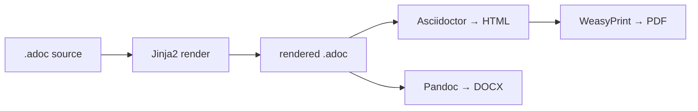

# ADR-001: AsciiDoc as Legal Template Source of Truth

## Status

Proposed (2026-08-26)

## Context

Four legal document templates are maintained as Jinja2 HTML templates:

| Source HTML                                                                         | AsciiDoc source created            |
| ----------------------------------------------------------------------------------- | ---------------------------------- |
| `app/adjudication/templates/adjudication/Legal_NonsampleAdjudication_Template.html` | `...Template.adoc`                 |
| `app/adjudication/templates/adjudication/template_nonsample_petition.html`          | `template_nonsample_petition.adoc` |
| `app/case_file_generator/templates/case_file_generator/petition.html`               | `petition.adoc`                    |
| `app/case_file_generator/templates/case_file_generator/permission_letter.html`      | `permission_letter.adoc`           |

Templates are verbose, poorly diffable in Git, and hard for non-technical stakeholders to review. All Jinja2 logic (variables, ``, ``, filters like `|length`) is preserved as-is across both formats — Jinja2 runs on `.adoc` before Asciidoctor/Pandoc convert to the final target.

**Output requirements:** PDF (existing WeasyPrint path) + Word (.docx) new.

## Decision

Maintain `.adoc` files as the source of truth. On generation:

1. **Jinja2 renders the `.adoc`** — passes the same route context (`{{ fbo_name }}`, ``, etc.).
2. **Rendered `.adoc` → HTML** via Asciidoctor (feeds the existing `generate_pdf_from_html()` → WeasyPrint PDF path, unchanged).
3. **Rendered `.adoc` → DOCX** via Pandoc (new Word output).

Original `.html` files are archived to `templates/archive/` as read-only reference.

## Pipeline

## Feature parity

| HTML feature            | HTML form                   | AsciiDoc form                     | Verdict      |
| ----------------------- | --------------------------- | --------------------------------- | ------------ |
| Variable                | `{{ var }}`                 | `{{ var }}` (Jinja2, passthrough) | ✅ identical |
| Conditional             | `…`    | same                              | ✅ identical |
| Loop                    | `` | same                              | ✅ identical |
| Filter `                | length > 1`                 | Jinja2 expr                       | same         | ✅ identical |
| Table                   | `<table>` HTML              | `\|===` AsciiDoc table            | ✅           |
| Page break              | CSS `break-after`           | `<<<`                             | ✅           |
| Embedded image (base64) | ``         | `image:data:…[]`                  | ✅           |
| Two-column layout       | Flex `.container`           | AsciiDoc column blocks            | ✅           |
| Blockquote              | `<blockquote>`              | `____` or `[quote]`               | ✅           |

## Migration steps

1. `.adoc` sources written ✅ (this session)
2. Add `scripts/adoc_render.py` utility (Jinja2 → HTML + Pandoc DOCX) — ~80 LOC
3. Pilot one route (`adjudication/preview`) to validate PDF byte-equivalence
4. Wire DOCX generation into remaining routes (same `format=docx` flag)
5. Archive old `.html` → `templates/archive/`; update docs

## Consequences

- Templates become human-editable in AsciiDoc with clean Git diffs.
- Word output added at low cost (Pandoc CLI, ~5 LOC).
- Asciidoctor gem added to dependencies.
- One preprocessor step between edit and PDF — Jinja2 still controls all conditional logic.
- No change to route context, data model, or PDF output currently in production.
