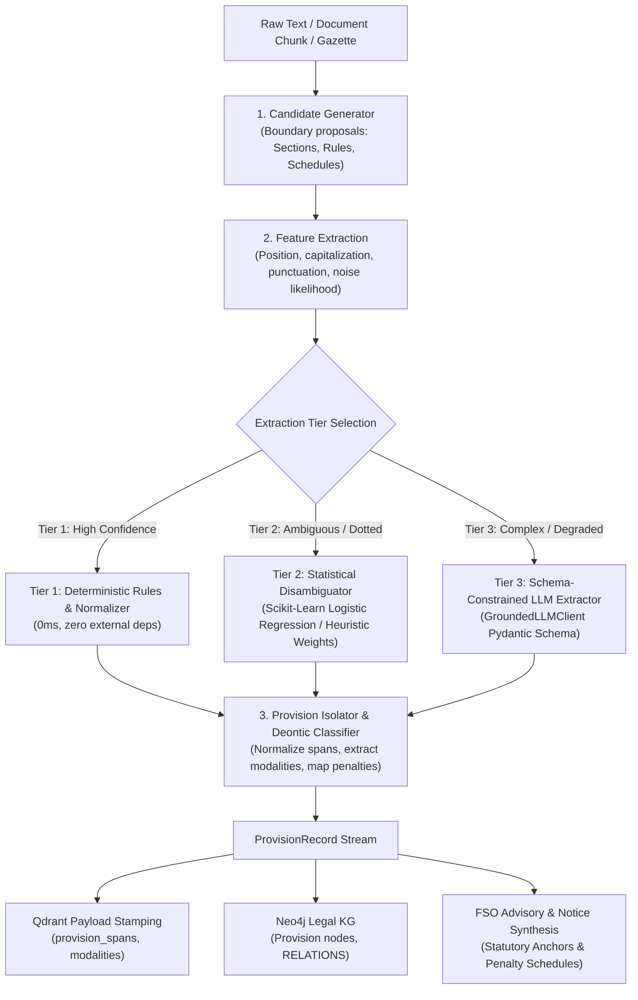

# ADR-0009: Tiered statutory provision extraction engine

- **Status:** Accepted; Tier 1 (rules) shipped and is the **default mode**. Tier 2 (hybrid ML) implemented but **not adopted** — the paired-bootstrap significance gate failed (see §8, 2026-10-02)
- **Date:** 2026-09-27
- **Context:** Ingestion & retrieval subsystems (`app/rag/`), Legal Metadata Engine (`app/metadata_extractor/`), and Legal Knowledge Graph (`kg/`)
- **Deciders:** Architecture review
- **Related terms in `CONTEXT.md`:** `Provision currency`, `QueryUnderstanding`, `FSO strategic advisory`, `DeterministicActSelector`

---

## 1. Context

Statutory provisions in the food safety regulatory domain (the Food Safety and Standards Act 2006, FSS Regulations, gazette notifications, and state amendments) carry high structural and deontic density:
1. **Hierarchical structure:** Sections, sub-sections, clauses, sub-clauses, provisos, and explanations.
2. **Deontic modalities:** Mandatory obligations on Food Business Operators (FBOs), statutory powers granted to Food Safety Officers (FSOs), prohibitions, and penal schedules (§§ 50–67).
3. **Complex relational semantics:** Enabling clauses (*"as may be prescribed"*), subordinations (*"subject to the provisions of"*), non-obstante overrides (*"notwithstanding anything contained in"*), and procedural linkages (*"read with"*).
4. **Temporal dynamics:** Continuous amendments, substitutions, and omissions promulgated through Central and State gazettes.

### Existing Limitations
Currently, provision extraction in `NSA_webservice` relies predominantly on static regular expressions (`app/rag/retrieval/reference_extractor.py`, `app/metadata_extractor/extractors/`) and generic token NER (`app/metadata_extractor/ner.py`, `app/rag/entity_extractor.py`). This creates key bottlenecks:
- **Brittleness under OCR & typography variations:** Punctuation drops, inline numbering, and degraded scans frequently break regex matchers.
- **Absence of deontic/norm extraction:** The system detects provision references (e.g., `Section 31`), but cannot isolate whether the text mandates a duty, defines a standard, or imposes a penalty.
- **Inability to parse compound penalty schedules:** FSO advisory requires exact penalty thresholds (§ 51 ₹5L, § 52 ₹3L, § 55 ₹2L, § 58 ₹2L, § 63 up to 6 months + ₹5L) to parameterize the game-theoretic payoff matrix without manual hardcoding.
- **Truncated chunk boundaries:** Vector indexing at arbitrary token splits separates provisos from their parent operative sections.

### Core Architecture Requirements
1. **Zero-overhead fast path:** Clean, standard legal texts must be parsed in sub-millisecond time.
2. **Fail-closed & offline-safe:** Absence of optional dependencies (`scikit-learn`, `torch`, external LLM APIs) must gracefully degrade to deterministic rule-based parsing without crashing.
3. **Immutable Chunk ID Contract:** Provision re-segmentation and extraction must never mutate existing Qdrant `chunk_id` values, preserving retrieval caches, gold evaluation benchmarks, and hash-chained audit trails.

---

## 2. Decision

We establish a **Tiered Hybrid Provision Extraction Engine** encapsulated in the new package `app/rag/provision_extractor/` and integrated across ingestion, retrieval, and Knowledge Graph pipelines.



### 2.1 The 3-Tier Cascade Model

1. **Tier 1 — Deterministic Fast-Path (Always Active):**
   - Grammar-aware regular expression engine combining section base parsers, dotted regulation patterns (`\d+\.\d+\.\d+`), and em-dash legal headers (`NN. Title.—`).
   - Handles standard, clean statutory text with $O(1)$ overhead.
2. **Tier 2 — Statistical ML Disambiguator (Optional In-Process):**
   - Lightweight logistic regression classifier trained on boundary features (line-start status, punctuation signatures, page-number proximity, gazette running-head indicators, year-token patterns).
   - Lazily imported via `scikit-learn`; automatically falls back to deterministic heuristic weights when `scikit-learn` or the model artifact (`models/provision_boundaries.joblib`) is unavailable.
3. **Tier 3 — Schema-Constrained LLM Extractor (Gated Fallback):**
   - Activated via `GroundedLLMClient` only for complex gazette notifications, multi-line nested provisos, or severely degraded OCR text where Tier 1 and Tier 2 confidence falls below `0.70`.
   - Constrained to emit strictly validated JSON satisfying the `ProvisionRecord` schema.

### 2.2 Domain & Data Contract

The engine emits immutable, structured `ProvisionRecord` instances:

```python
class DeonticModality(str, Enum):
    OBLIGATION = "obligation"          # "shall ensure", "must maintain"
    PROHIBITION = "prohibition"        # "no person shall manufacture/sell"
    POWER = "power"                    # "Food Safety Officer may seize"
    PENALTY = "penalty"                # "liable to penalty not exceeding..."
    DEFINITION = "definition"          # "means and includes"
    EXEMPTION = "exemption"            # "Provided that nothing shall apply..."
    PROCEDURE = "procedure"            # "sample shall be sent to food analyst"

class ProvisionRecord(BaseModel):
    model_config = ConfigDict(frozen=True)

    provision_id: str                  # Canonical: e.g. "FSSA_2006::s31(2)(a)"
    act_name: str                      # Canonical Act / Regulation title
    family_id: str                     # Grouping ID: "FSSA_2006::31"
    section: str                       # Base section / rule / regulation number
    subsection: list[str] = []         # Ordered subsection chain
    clause: list[str] = []             # Ordered clause / subclause chain
    title: str = ""                    # Provision header / margin title
    text: str                          # Operative isolated provision text
    modality: DeonticModality          # Primary legal modality
    subject_entity: str | None = None  # FBO, FSO, Food Analyst, Commissioner
    penalty_max_inr: float | None = None # Numerical fine ceiling if applicable
    imprisonment_max_months: int | None = None # Imprisonment limit if applicable
    cross_references: list[str] = []   # Cited sections / rules ("read with § 58")
    is_proviso: bool = False           # Flag for conditional exception clauses
    source_chunk_ids: list[str] = []   # Provenance links to underlying chunks
    confidence: float                  # Extraction confidence [0.0 - 1.0]
    extraction_tier: str               # "tier1_regex" | "tier2_ml" | "tier3_llm"
```

### 2.3 Integration Seams & Feature Flags

1. **Configuration Seam ([`app/shared/config.py`](file:///C:/github/NSA_webservice/app/shared/config.py)):**
   - `PROVISION_EXTRACTOR_ENABLED` (boolean, default: `true`).
   - `PROVISION_EXTRACTOR_MODE` (enum: `rules` | `hybrid` | `llm_fallback`, default: `rules`).
   - `PROVISION_EXTRACTOR_MIN_CONFIDENCE` (float, default: `0.70`).
2. **Ingestion Seam ([`kg/corpus_ingestion.py`](file:///C:/github/NSA_webservice/kg/corpus_ingestion.py), `app/rag/ingestion.py`):**
   - Provision extraction runs as an enrichment stage following initial chunking.
   - Attaches `provision_spans` and `deontic_modality` to chunk payloads in Qdrant.
3. **Retrieval & Advisory Seam ([`app/rag/retrieval/`](file:///C:/github/NSA_webservice/app/rag/retrieval/), [`app/rag/advisor/`](file:///C:/github/NSA_webservice/app/rag/advisor/)):**
   - `QueryUnderstanding` resolves natural language intent directly to canonical `provision_id` targets.
   - `DeterministicActSelector` consumes structured `penalty_max_inr` and `modality` fields to evaluate statutory consequence payoffs.

---

## 3. Consequences

### Positive
- **High Semantic Grounding:** Enables exact sub-section and proviso citation in statutory notices (u/s 32 Improvement Notices) and adjudication complaints.
- **Robustness Across Diverse Formats:** Unifies parsing of Acts, Central Gazette Notifications, and State Food Safety Orders under a single resilient seam.
- **Auditability & Zero Regression:** Strict adherence to the `frozen=True` Pydantic models ensures thread-safety, deterministic serialization, and full testability without network dependencies.
- **Knowledge Graph Precision:** Directly populates Neo4j edges (`MANDATES`, `PROHIBITS`, `PENALIZES`, `AMENDS`, `EXEMPTS_FROM`) without heuristic post-processing.

### Trade-Offs & Mitigations
- **Optional Dependency Isolation:** `scikit-learn` and model artifacts are loaded lazily. If missing, the engine logs a warning and routes through Tier 1 heuristic disambiguation with zero downtime.
- **Corpus Backfill Safety:** Corpus re-indexing is executed via a dry-run diff script (`scripts/backfill_provision_extraction.py`). `chunk_id` hashes remain unmodified to avoid invalidating existing vector embeddings and test caches.

---

## 4. Verification & Testing Strategy

1. **Unit & Golden Fixture Suite (`tests/test_provision_extractor.py`):**
   - Verification across 100 gold-standard provision samples spanning:
     - Standard Act sections (`Section 31(2)(a)`).
     - Multi-tier Dotted Regulations (`Regulation 2.3.1.4`).
     - Conditional provisos and compound penalty provisions (§§ 50, 51, 52, 59, 63).
2. **Fallback Verification:**
   - Unit test asserting full functionality when `scikit-learn` is monkeypatched as absent (`test_rules_fallback_without_sklearn`).
3. **Round-Trip Gold Resolution:**
   - All emitted `provision_id` strings must parse through `evaluation/benchmark.py::_section_from_id` and match benchmark gold targets.

---

## 5. Adoption Gate Result (2026-10-02)

The Tier 2 (hybrid rules + statistical ML) tier is adopted over Tier 1 (rules)
only if it beats rules on boundary recall AND gold resolution with a
non-overlapping paired 95% bootstrap confidence interval, bootstrapped over
documents (10,000 iterations, seed `20260811` from `evaluation/config.py`).

Harness: `evaluation/provision_significance.py`
(`bootstrap_significance` / `bootstrap_significance_report`), exposed via
`python -m evaluation.provision_extraction_eval --bootstrap`.

Corpus: 63 indexed documents, 27,345 chunks, 11 of which carry gold references.

| Metric | Rules (per-doc mean) | Hybrid | Mean diff | 95% CI | Significant |
| --- | --- | --- | --- | --- | --- |
| Boundary recall | 0.773 | 0.788 | +0.0152 | [-0.045, 0.091] | No |
| Gold resolution | 0.773 | 0.788 | +0.0152 | [-0.045, 0.091] | No |

Aggregate report figures agree in direction: rules P=0.021 / R=0.811 / F1=0.041
with gold resolution 0.303; hybrid P=0.022 / R=0.838 / F1=0.044 with gold
resolution 0.313. Hybrid also resolved 3 gold provisions that rules missed
(`gold_miss_triage_delta = 3`).

**Verdict: `adopt_hybrid = false`.** Both intervals straddle zero, so the
+1.5pp recall / +3-provision gain is not distinguishable from noise at n=11
documents. Decisions:

- `PROVISION_EXTRACTOR_MODE` stays `rules` (the shipped default).
- Tier 2 stays implemented and reachable behind the flag; it is not the default
  and `models/provision_boundaries.joblib` remains uncommitted (training is
  reproducible via `scripts/train_provision_boundaries.py`).
- Revisit only when the gold-referenced document count grows enough for the
  bootstrap to have power, or when Tier 1 recall regresses.

**Revisit check (2026-10-02, second pass):** neither trigger condition is
met, so the verdict stands.

- Gold-referenced documents: still **11 of 63** indexed. The registry holds
  99 provisions over 22 documents, but 11 documents (44 provisions —
  including the 41-provision FSS Act block) are not in the payload index
  (`document_absent`), so they contribute no bootstrap rows. Power at the
  observed effect (+0.0152 mean per-doc diff, sd 0.1168): ~228
  gold-referenced documents (~21× current) are needed for the 95% CI to
  exclude 0.
- Tier 1 recall: unchanged — micro 0.811 (30/37), per-doc mean 0.773,
  noise 0.0000, gold resolution 0.303. No regression.
- Tier-2 artifact retrained (seed 20260928, test F1 0.737, sha256
  `a0951834…`) and re-gated the same day (10:38 UTC): recall 0.773→0.788,
  CI [-0.045, 0.091], `adopt_hybrid=false` — identical to the morning gate.

Next trigger events: index the missing gold documents (above all the FSS
Act corpus carrying 41 gold provisions), or a Tier-1 recall drop.
