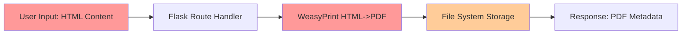
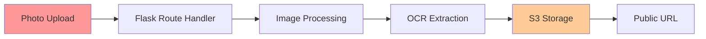
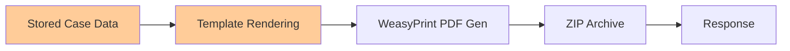
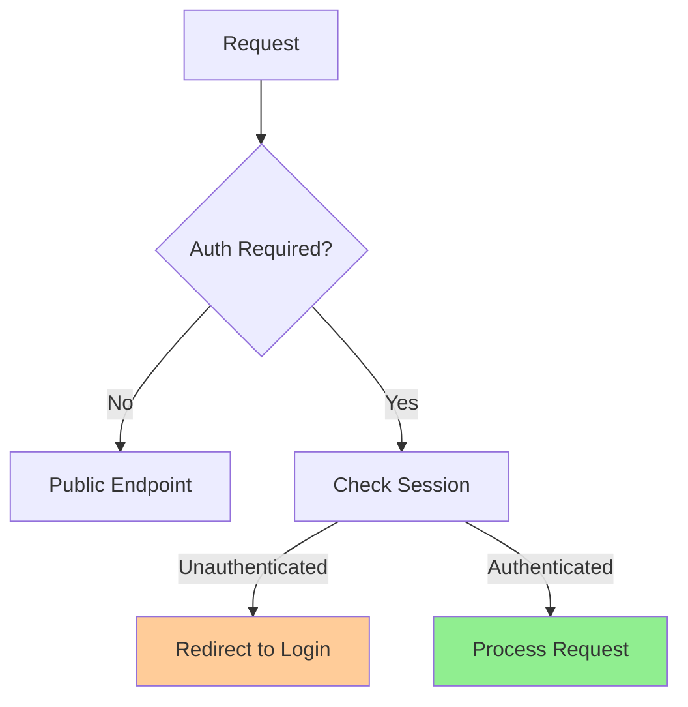
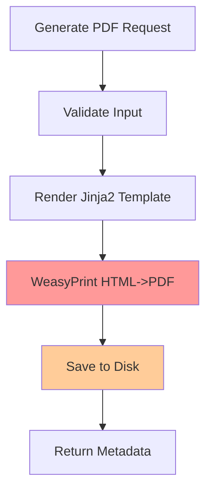

# Phase 3 Knowledge Base Report

## Project Classification

**Type**: Web Application (Flask-based Python web service)

**Purpose**: Non-sample adjudication and food safety management system for Food Safety Officers (FSOs). The application provides:
- Inspection management and CRUD operations
- Sample collection tracking
- Case file generation (PDF)
- Adjudication workflows
- Bill generation (PDF)
- FBO issue tracking
- Audit logging

**Language/Runtime**: Python 3.x with Flask framework

## Architecture Model

### Components

| Component | Category | Purpose | Trust Level |
|-----------|----------|---------|-------------|
| Flask App | Web Framework | HTTP request handling, routing, session mgmt | Boundary |
| PostgreSQL | Database | Primary data store | Internal |
| Redis | Broker/Backend | Celery task queue, caching | Internal |
| Celery | Task Queue | Async PDF generation, OCR, image processing | Internal |
| Google Sheets API | External Service | Data sync, reporting | External |
| Cloudflare R2/B2 | Object Storage | Photo evidence storage | External |
| WeasyPrint | PDF Library | HTML-to-PDF generation | Internal |
| gspread | Google API Client | Sheets integration | Internal |
| boto3 | AWS SDK | R2/B2 storage | Internal |

### Transports

- **HTTP/HTTPS**: Primary client-server communication
- **Redis Protocol**: Broker/backend communication
- **HTTPS**: Google Sheets API
- **S3-compatible API**: R2/B2 storage

### Trust Boundaries

1. **Internet-Facing**: HTTP endpoints (Flask application)
2. **Internal**: PostgreSQL database, Redis cache/broker
3. **External**: Google Sheets API, Cloudflare R2/B2 storage

## DFD Slices (Data-Flow Diagram)

### High-Risk Flow 1: PDF Generation with User HTML



**Attack Vectors**:
- SSRF via WeasyPrint HTML (file://, http:// URLs)
- File attachment via data: URIs
- CSS injection
- Image processing attacks

### High-Risk Flow 2: Photo Upload and Storage



**Attack Vectors**:
- Malicious image files (polyglot, EXIF-based)
- Path traversal in filenames
- Storage bucket enumeration

### High-Risk Flow 3: PDF Regeneration from Stored Data



**Attack Vectors**:
- Template injection via Jinja2
- Data exfiltration through PDF
- Embedded malicious content

## CFD Slices (Control-Flow Diagram)

### Authentication Flow



### PDF Generation Control Flow



## Framework Contracts and Hidden Control Channels

### Middleware/Proxy Headers

| Header | Component | Security Impact |
|--------|-----------|-----------------|
| `X-Forwarded-Proto` | ProxyFix (app/__init__.py:75) | TLS termination detection for Talisman HTTPS enforcement |
| `X-Forwarded-For` | ProxyFix | Client IP extraction for audit logs |
| `X-Real-IP` | ProxyFix | Client IP extraction |

**Risk**: If ProxyFix is misconfigured (x_for=1, x_proto=1), an attacker could:
- Spoof TLS detection to bypass HTTPS enforcement
- Spoof client IP to evade rate limiting/audit

### Session Security

| Setting | Value | Purpose |
|---------|-------|---------|
| `SESSION_COOKIE_SECURE` | `is_production` | HTTPS-only cookie |
| `SESSION_COOKIE_HTTPONLY` | `True` | XSS protection |
| `SESSION_COOKIE_SAMESITE` | `Lax` | CSRF protection |
| `PERMANENT_SESSION_LIFETIME` | 30 minutes | Session expiry |

### Flask-Talisman CSP

```python
csp = {
    'default-src': ["'self'"],
    'script-src': ["'self'", "'unsafe-inline'"],
    'style-src': ["'self'", "'unsafe-inline'"],
}
```

**Risk**: `'unsafe-inline'` in script-src allows XSS if user input reaches template.

### Authentication Guard

**Location**: `app/__init__.py:111-116`

```python
PUBLIC_ENDPOINTS = {
    "auth.login",
    "static",
}

@app.before_request
def require_login():
    if request.endpoint and request.endpoint not in PUBLIC_ENDPOINTS:
        if not current_user.is_authenticated:
            return redirect(url_for("auth.login", next=request.url))
```

**Control Channel**: The `PUBLIC_ENDPOINTS` set is the **only** mechanism for public access. If a route is accidentally added without proper auth, it becomes public.

### CSRF Protection

**Location**: `app/extensions.py` (Flask-WTF CSRF)

- Applied globally via `csrf.init_app(app)`
- Protects POST/PUT/DELETE requests
- **Risk**: API endpoints using `request.get_json()` may bypass CSRF if not properly configured

### Template Engine (Jinja2)

**Location**: `app/utils/filters.py`, template rendering in routes

- Custom filters: `to_words`, `format_date`, `format_date_indian`
- **Risk**: If user-controlled data reaches `render_template_string()` or similar, SSTI is possible

### File Upload Security

**Location**: `app/utils/storage.py`

- Extension whitelist: `.jpg`, `.jpeg`, `.png`, `.webp`, `.heic`
- Max size: 5MB
- **Risk**: No MIME type validation, EXIF-based attacks possible

## Domain Attack Modes

### WeasyPrint PDF Generation

**Attack Class Table**:

| Attack Class | CWE | Description | Severity |
|--------------|-----|-------------|------------|
| SSRF | CWE-918 | HTML containing file:// URLs or internal hostnames | HIGH |
| File Attachment | CWE-829 | HTML allowing arbitrary file inclusion via data: URIs | HIGH |
| CSS Injection | CWE-74 | CSS expressions, @import attacks | MEDIUM |
| Image Processing | CWE-434 | Malicious image files processed by WeasyPrint | MEDIUM |

**Custom SAST Targets**:
- RemoteFlowSource → HTML string to WeasyPrint
- HTML with file:/ scheme
- HTML with internal IP ranges
- CSS @import or behavior properties

**Manual Review Checklist**:
- [ ] All HTML passed to WeasyPrint comes from trusted sources
- [ ] file:// URLs are blocked or sanitized
- [ ] Internal IP ranges are excluded from URL resolution
- [ ] CSS is sanitized or restricted to safe properties

### Photo Upload and Processing

**Attack Class Table**:

| Attack Class | CWE | Description | Severity |
|--------------|-----|-------------|------------|
| Unrestricted Upload | CWE-434 | Malicious files with valid extensions | MEDIUM |
| Image Truncation | CWE-781 | Malformed images causing buffer issues | LOW |
| EXIF-based | CWE-625 | Malicious EXIF data | LOW |

**Custom SAST Targets**:
- File upload → storage without validation
- Image processing with PIL/Pillow

### Google Sheets Integration

**Attack Class Table**:

| Attack Class | CWE | Description | Severity |
|--------------|-----|-------------|------------|
| Credential Exposure | CWE-522 | Service account JSON in environment | HIGH |
| Data Exfiltration | CWE-200 | Sync to external sheet | MEDIUM |

### Celery Task Queue

**Attack Class Table**:

| Attack Class | CWE | Description | Severity |
|--------------|-----|-------------|------------|
| Command Injection | CWE-78 | Task metadata injection | HIGH |
| Task Poisoning | CWE-504 | Malicious task data | MEDIUM |

## Coverage Gaps

### Identified Gaps

1. **No dependency lockfile** (requirements-lock.txt or poetry.lock)
   - Cannot verify exact dep
